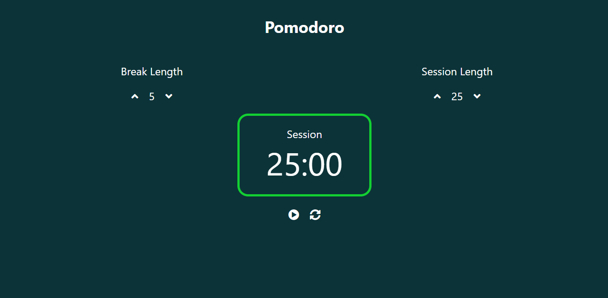

# :clock10: Pomodoro Clock

Building a pomodoro clock

Demo link: [Pomodoro](https://sureshmangs.github.io/pomodoro-clock/)

## :arrow_right: Technologies Used:

:one: React

## :arrow_right: Get Started

Clone the repository

`git clone https://github.com/sureshmangs/pomodoro-clock.git`

In the project directory(pomodoro-clock)

`npm install`


To run the application, in the project directory(pomodoro-clock)

`npm start`


## :arrow_right: Demo





## :arrow_right: Deploy to Github Pages

```
Create your react app
npx create-react-app app-name
cd app-name
git init
git remote add origin "url"

npm i gh-pages --save-dev

Make following updation in the package.json file:

Add a homepage key-value pair in your json

"homepage": "https://{your_github_username}.github.io/{your_app_name}"

ie: "homepage": "https://sureshmangs.github.io/app-name"

Add the floowing in your scripts in package.json:

"scripts": {
	"predeploy": "npm run build",
    "deploy": "gh-pages -d build",
}


Now run the command npm run deploy and your will be deployed to the url specified in the homepage.
```


## :arrow_right: License

MIT License


